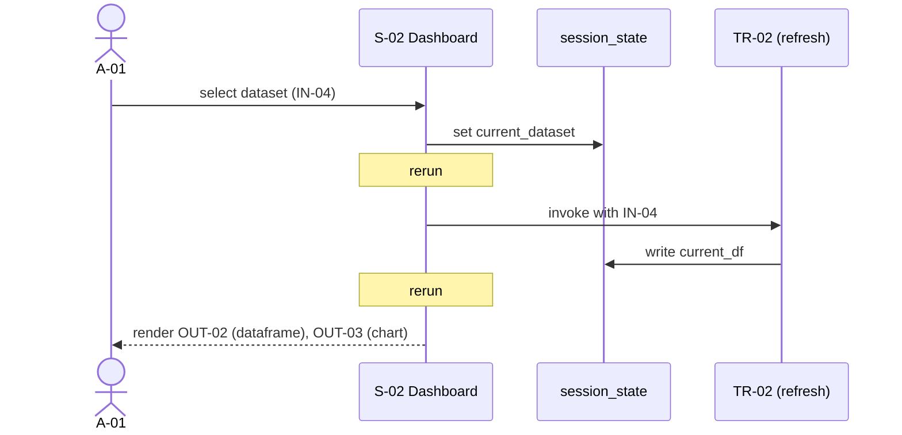
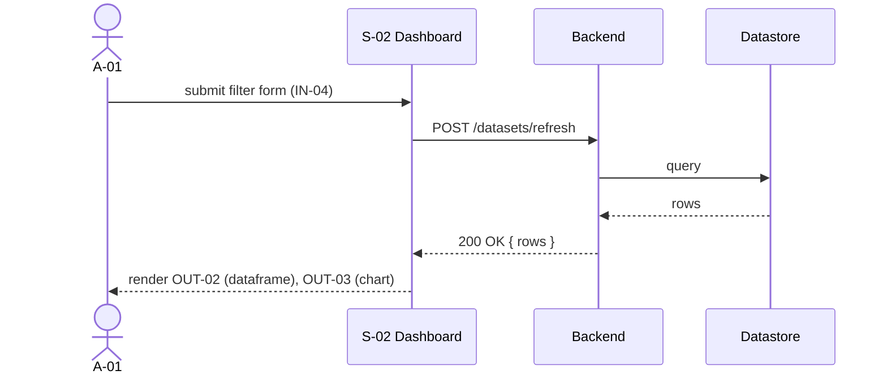

# Mermaid sequence-diagram templates — `user-flow-analyst`

> Reference doc for `user-flow-analyst`. Read at runtime when drawing
> sequence diagrams per UC.

Use these skeletons as the starting point for every UC diagram. Streamlit
mode reruns are first-class — never hide them.

---

## Streamlit-mode skeleton (reactive, with reruns)

Reruns are the defining characteristic of the Streamlit stack. Every state
mutation that triggers a rerun MUST be visible in the diagram via a
`Note over <screen>: rerun` line.

---

## Generic-mode skeleton (request → response, no rerun loop)

For non-Streamlit stacks, sequence diagrams are conventional. Lanes are
actor → screen/page → backend service → store; arrows are method calls
or HTTP requests.

---

## Required lanes per diagram

For each non-trivial UC, the diagram MUST show:

- **actor lanes** — every primary and secondary actor referenced in the UC
- **screen / component lanes** — every S-NN involved in the flow
- **state lane** — `session_state` for Streamlit, omitted for generic
- **transformation lanes** — every TR-NN invoked
- **input/output annotations** — IN-NN and OUT-NN as message payloads

---

## Cross-cutting reusable patterns

When the same shape repeats across UCs, lift it into
`08-sequence-diagrams.md` under "Cross-cutting patterns" and reference it
from each UC instead of redrawing. Typical reusable patterns:

- **Filter → rerun → render** (Streamlit-specific) — shared across any UC
  that mutates a filter widget.
- **Wizard step transition** — page that branches on
  `st.session_state.step` and reruns to render the next step.
- **Callback chain** — `on_change`/`on_click` mutates state and cascades
  into further reruns.
- **Forced rerun** — `st.rerun()` invoked explicitly; flag the UC as "uses
  forced rerun" in Notes.
