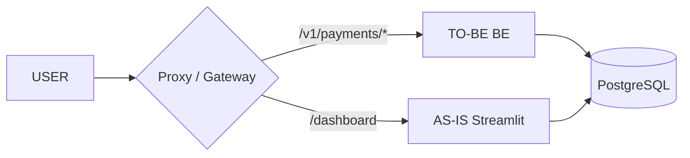
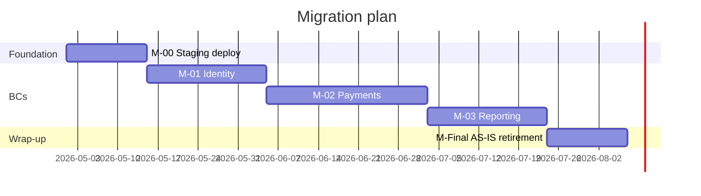

# Migration roadmap — deliverable template

> Reference doc for `migration-roadmap-builder`. Read at runtime when
> emitting `docs/refactoring/roadmap.md` and the agent's reporting block.

## Goal

Verbatim deliverable skeleton: roadmap document layout (frontmatter,
TL;DR, topology + Gantt diagrams, milestone template, risk register
cross-reference, AS-IS bug carry-over, communication plan) plus the
text-response reporting block the agent prints back to the supervisor.

---

## File: `docs/refactoring/roadmap.md`

```markdown
---
agent: migration-roadmap-builder
generated: <ISO-8601>
sources: [...]
related_ucs: [UC-01, UC-02, ...]   (all UCs covered in milestones)
related_bcs: [BC-01, BC-02, ...]
confidence: <high|medium|low>
status: <complete|partial|needs-review|blocked>
duration_seconds: <int>
---

# Migration roadmap

## Executive summary (TL;DR)

- **Approach**: strangler fig with per-BC cutover behind <Topology A | B>.
- **Total milestones**: <N> (1 foundation + <K> BC milestones + 1 AS-IS retirement).
- **Estimated duration**: <total weeks>.
- **Equivalence target**: 100% of UCs vs Phase 3 baseline.
- **Performance target**: p95 ≤ 110% of AS-IS baseline.
- **Risk class**: <low | medium | high>.

## Cutover topology

<one-paragraph rationale + diagram>



## Gantt overview



## Milestones

(One section per milestone — see `examples.md` for fully worked entries
and the per-milestone template below.)

### Per-milestone template

```
Milestone M-NN: <BC name>
- Pre-conditions:
  - <list>
- Activities:
  - logic-translator full coverage for UCs in this BC
  - Phase 5 testing passes (equivalence, contract, performance)
  - hardening verified for this BC's surface
  - data migration script (if applicable) tested in staging
  - rollback plan rehearsed
- Cutover steps:
  1. enable feature flag at <traffic %> (1% → 10% → 50% → 100%)
  2. monitor for <X> hours per stage
  3. AS-IS module retirement only after 100% TO-BE for <X> days
- Go-live criteria:
  - <list>
- Rollback trigger:
  - error rate >X% above AS-IS baseline (Phase 3) sustained Y minutes
  - p95 latency >110% of baseline sustained
  - critical security finding
- Rollback procedure:
  - feature flag → 0%
  - DNS unchanged
  - data: <append-only writes preserved | reconciliation script if
    needed>
- Estimated duration: <e.g., 2 weeks>
- Dependencies:
  - M-(NN-1) complete
  - <other>
- Risks specific to this milestone:
  - <list>
- Stakeholder sign-off required from: <PO, security, ops>
```

## Risk register cross-reference

| Risk (Phase 2/3) | Severity | Roadmap mitigation | Milestone |
|---|---|---|---|
| RISK-DA-04 race condition on register | high | UNIQUE constraint + DB-level idempotency | M-01 |
| BUG-04 (deferred) silent payment failure | critical | TO-BE explicit error handling per logic-translator | M-02 |
| SEC-02 SQL injection in reports | critical | parameterized queries in TO-BE | M-03 |

## AS-IS bug carry-over (deferred from Phase 3)

| BUG-NN | Severity | Disposition | Milestone | Notes |
|---|---|---|---|---|
| BUG-04 | critical | fix-in-flight | M-02 | logic-translator implements proper error handling |

## Communication plan

- Pre-cutover (T-1 week): email blast, training session for end users.
- Cutover (T-0): #migrations Slack channel; status page; on-call eng
  + ops + security in war-room.
- Post-cutover (T+1d, T+1w): retrospective; lessons-learned doc.

## Open questions

- Cutover topology decision: A or B (security to confirm)
- Production secrets manager: Vault vs AWS SM (ops to confirm)
- AS-IS DB schema migration vs. dual-write: requires DBA review
```

---

## Reporting (text response)

```markdown
## Files written
- docs/refactoring/roadmap.md

## Roadmap stats
- Total milestones:      <N>
- BC milestones:         <K>
- Foundation + retire:   2
- Total estimated time:  <weeks>
- UCs covered:           <N>/<M>
- Cutover topology:      A | B | C

## Cross-references
- ADR refs:              ADR-001..005
- Phase 3 baseline:      <link>
- AS-IS bug carry-over:  <N> bugs
- Risk register cross-ref: <N> risks

## Confidence
high | medium | low

## Duration (wall-clock)
<seconds>

## Open questions
- <e.g., "ops team to confirm secrets manager choice — placeholder
  in M-00 activities">
```
