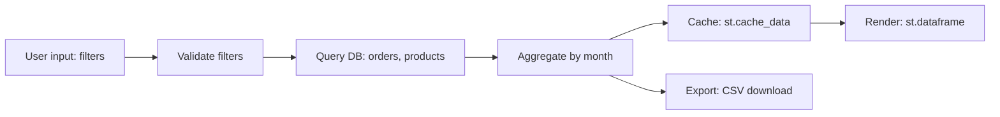

# Data-access analyst — output templates

> Reference doc for `data-access-analyst`. Read at runtime when starting to
> write either of the two output files. Both files MUST be produced via the
> `Write` tool — see `file-writing-rule.md` in the same folder.

## File 1: `docs/analysis/02-technical/04-data-access/data-flow-diagram.md`

```markdown
---
agent: data-access-analyst
generated: <ISO-8601>
sources:
  - .indexing-kb/06-data-flow/database.md
  - .indexing-kb/06-data-flow/file-io.md
  - .indexing-kb/04-modules/*.md
  - docs/analysis/01-functional/11-transformations.md  # if available
confidence: <high|medium|low>
status: <complete|partial|needs-review|blocked>
---

# Data-flow diagram

## Cluster: <name, e.g., "Reporting flow">



### Notes
- <observations: bottlenecks, missing validations, caching opportunities,
  cache-invalidation gaps>

## Cluster: <next>
- ...

## Cross-reference with Phase 1 transformations

| TR-NN (Phase 1) | Implementing pattern (this doc) |
|---|---|
| TR-01 | DB query in `reports.py:42`, in-memory aggregation, st.cache_data |

## Open questions
- <e.g., "data origin for chart Y is unclear; the function uses both a
  DB query AND a hard-coded fallback list">
```

## File 2: `docs/analysis/02-technical/04-data-access/access-pattern-map.md`

```markdown
---
agent: data-access-analyst
generated: <ISO-8601>
sources: [...]
confidence: <high|medium|low>
status: <complete|partial|needs-review|blocked>
---

# Access-pattern map

## Database

- **Engine**: PostgreSQL 14 (verified from `<repo-path>:<line>`)
- **Library**: SQLAlchemy 2.x, classical mappers
- **Connection management**: pooled, scoped session per request
- **Schema migrations**: Alembic
- **Tables touched** (from KB):
  - `users` (read)
  - `orders` (read, write)
  - `audit_log` (write-only)

### Query patterns

| Pattern | Count (approx.) | Risk |
|---|---|---|
| Parameterized via SQLAlchemy ORM | ~60 | none |
| Raw SQL with `text()` + params | 4 | none |
| Raw SQL with f-string interpolation | 2 | **SQL injection — flag** |

### Findings

#### RISK-DA-01 — Raw SQL with f-string interpolation
- **Severity**: critical | high
- **Locations**: `<repo-path>:<line>`
- **Description**: <details>
- **Sources**: [<repo-path>:<line>]

## File system

- **Read paths**:
  - `<repo>/config/*.yaml` (config)
  - `<external>/data/*.csv` (input data — path from env var)
- **Write paths**:
  - `/tmp/exports/*.xlsx` (user-triggered exports)
  - `<repo>/logs/*.log` (operational logs — see resilience-analyst)
- **Path construction**: mostly Path objects; 3 sites use `os.path.join`
  + concatenation
- **Formats**: CSV (read), Excel (write), JSON (config), pickle (1 site)

### Findings

#### RISK-DA-02 — Pickle deserialization of user-uploaded files
- **Severity**: critical
- **Location**: `<repo-path>:<line>`
- **Description**: pickle.load() applied to st.file_uploader output
  → arbitrary code execution
- **Sources**: [...]

## Cache

- **Streamlit**:
  - `st.cache_data` decorating <N> functions
  - `st.cache_resource` decorating <N> functions
- **Invalidation correctness**:
  - <function>: keys cover all inputs ✓
  - <function>: missing key for `current_user` — stale risk
- **External cache**: <Redis 7 / none>

### Findings

#### RISK-DA-NN — Cache invalidation gap
- ...

## Serialization

| Format | Read | Write | Trust source |
|---|---|---|---|
| JSON | yes | yes | trusted (config) |
| YAML | yes | no | trusted |
| Pickle | yes | yes | **untrusted (file upload) — flag** |

## Open questions
- <e.g., "DB engine inferred from connection string in env var; not
  verified from schema files">
```
